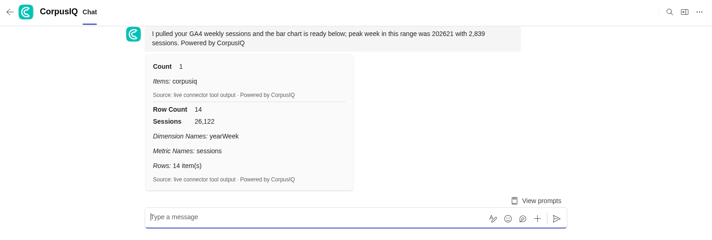

# Getting started in Microsoft Teams

Three steps, once. The only real difference from Slack is how you sign in —
Teams uses your Microsoft account, so it's usually a single tap.

## Step 1 — Sign in to CorpusIQ

The app won't read any data until it knows who you are. In Teams, this uses the
Microsoft account you're already signed in with.

1. Open a chat with the CorpusIQ app and send it a message — a simple "hi" is
   enough the first time.
2. If you're not linked yet, the app shows a **Sign in** prompt. Tap it.
3. Confirm with your Microsoft account. Because you're already signed in to
   Teams, this is usually one tap with nothing to type.
4. Once you're connected, ask your question again and the app answers.

<!-- screenshot: the CorpusIQ sign-in card in a Teams chat -->

You only do this once. The app stays linked until you sign out.

If the sign-in prompt doesn't appear, or tapping it doesn't complete, see
[troubleshooting.md](troubleshooting.md).

## Step 2 — Set your AI key

CorpusIQ does the thinking with an AI model, and in Slack and Teams you bring
your own key for it. This keeps the AI spend and the data on the model side
inside your own account.

You add the key once, in the CorpusIQ dashboard (not in Teams):

1. Sign in at [the CorpusIQ dashboard](https://www.corpusiq.io).
2. Go to your AI key settings.
3. Paste in a key from OpenAI, Anthropic, or Azure OpenAI and save.

<!-- screenshot: the dashboard AI key setting with a provider selected -->

If your first question comes back asking for a key, this is the step you're
missing. Some workspaces provide the key for everyone — if a question answers
without you setting one, you're already covered.

Azure OpenAI is worth calling out for Microsoft-centric teams: using it keeps
the model calls inside your own Azure tenant, alongside the rest of your
Microsoft stack.

## Step 3 — Ask your first question

Two ways to ask:

- **Message the app directly** for a private answer.
- **@-mention it** in a Teams channel when the answer is useful to everyone in
  the channel.

Plain English. A good first question is one you can sanity-check:

> How much revenue did we bring in last month?

> Which ad campaigns spent the most last week?

> How many orders are waiting to ship?

The answer comes back as a card — key numbers laid out, not a paragraph to
squint at.

If a question needs a tool you haven't connected, the app tells you and links
you to connect it in the dashboard. Connect once, ask again, done.

## That's it

Two one-time steps behind you. From here it's just asking. For questions worth
trying next, see [asking-questions.md](asking-questions.md).
