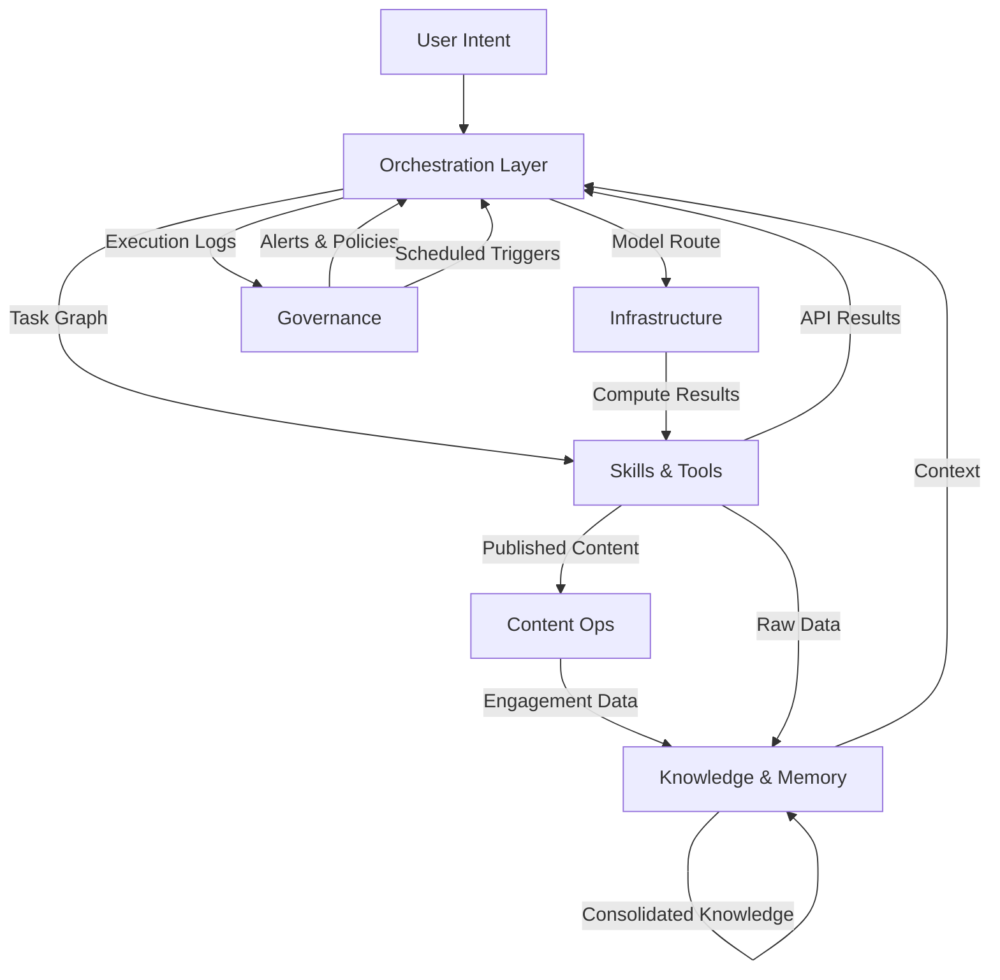

# Production Autonomous Agent Architecture

Most agent implementations follow a common pattern: install the framework, connect an LLM, add tools, and execute tasks through chat. While effective for experimentation, these architectures remain fundamentally human-dependent. The agent can answer questions. The agent cannot operate a business.

A production system requires: long-term memory, persistent identity, workflow orchestration, knowledge consolidation, browser automation, governance controls, authentication management, multi-model optimization, operational monitoring, and autonomous execution.

This document outlines the architecture that bridges that gap.

## System Architecture — The Six-Layer Model

The platform decomposes into six layers, each with distinct responsibilities, failure domains, and scaling characteristics:

### Layer 1: Agent Orchestration

The brain stem. This layer handles task decomposition, agent routing, model selection, and execution lifecycle management. It receives high-level intent and produces structured workflows.

**Components:** Hermes Agent (execution kernel), CrewAI (multi-agent coordination), LangGraph (stateful graph execution), Reflexion (self-improvement loops)

**Key responsibility:** Given a user intent, produce an execution plan and dispatch it to the appropriate agents with the right models.

**Data flowing in:** Natural language intents, scheduled triggers, event hooks
**Data flowing out:** Structured task graphs, agent assignments, model routing decisions

### Layer 2: Skills and Tooling

The muscle system. This layer provides domain-specific capabilities — everything the agents can actually *do*.

**Components:** 70+ skills across marketing, engineering, operations, and content; 65+ CLI tools; MCP infrastructure with 50+ operational tools; FastMCP validation layer

**Key responsibility:** Translate agent actions into concrete API calls, database queries, file operations, and external service interactions.

**Data flowing in:** Structured task definitions from orchestration layer
**Data flowing out:** API responses, file contents, database results, tool outputs

### Layer 3: Infrastructure

The skeleton. Compute resources, networking, and runtime environments.

**Components:** Primary compute (DGX-class node for inference and orchestration), worker node (dedicated browser automation and content ops), authentication management, multi-model router, browser automation with Playwright stealth

**Key responsibility:** Provide reliable, cost-optimized execution environments. Handle model failover, authentication lifecycle, and cross-node communication.

**Data flowing in:** Execution requests from orchestration, model inference calls
**Data flowing out:** Computation results, browser screenshots, authenticated sessions

### Layer 4: Content Operations

The voice. Everything the system produces for external consumption.

**Components:** Video generation pipeline (scripting, avatar rendering, post-production), social publishing engine (multi-platform scheduling, content rotation), engagement system (community response, help-first strategy)

**Key responsibility:** Generate, schedule, publish, and monitor content across platforms. Handle rate limits, platform-specific formatting, and engagement tracking.

**Data flowing in:** Content briefs from orchestration, engagement data from platforms
**Data flowing out:** Published posts, videos, comments, engagement reports

### Layer 5: Knowledge and Memory

The memory. Persistent knowledge that accumulates and compounds over time.

**Components:** GraphRAG (entity-relationship retrieval), persistent knowledge base (700+ indexed files, vector embeddings, semantic search), dream cycle (nightly consolidation at 03:00), Honcho (conversation memory and peer modeling)

**Key responsibility:** Store everything learned. Retrieve relevant context instantly. Consolidate knowledge nightly. Never forget.

**Data flowing in:** Raw conversation data, tool outputs, user interactions, web research
**Data flowing out:** Contextual knowledge for agent decisions, semantic search results, consolidated facts

### Layer 6: Governance and Operations

The immune system. Monitoring, validation, scheduling, and compliance.

**Components:** System registry (pre-creation validation), email operations (inbox monitoring for team@ and info@), cron scheduler (38+ scheduled processes), token lifecycle management, model usage tracking

**Key responsibility:** Ensure everything runs correctly. Detect failures early. Enforce policies. Provide audit trails.

**Data flowing in:** System metrics, execution logs, token usage, error reports
**Data flowing out:** Alerts, status dashboards, compliance reports, scheduling triggers

## Data Flow Architecture

### Critical Data Paths

1. **Intent-to-Action Path:** User Intent → Orchestration decomposes → Skills execute → Results flow back → Knowledge stores. This is the hot path. Latency matters here.

2. **Learning Path:** Tool outputs → Knowledge store → Nightly dream cycle → Consolidated facts. This is the compounding path. Throughput matters here, not latency.

3. **Governance Path:** Every action → Log → Governance validation → Alert if anomaly. This is the safety path. Completeness matters here.

4. **Content Path:** Orchestration generates brief → Content ops produces media → Publishes → Engagement data returns → Knowledge updates strategy. This is the growth path. Consistency matters here.

## Failure Mode Analysis

Every layer has distinct failure modes. Understanding them is critical for designing resilient systems.

### Layer 1 Failures: Orchestration

| Failure Mode | Probability | Impact | Mitigation |
|---|---|---|---|
| Model hallucinates execution plan | Medium | High — wrong task executed | Reflexion evaluation loop validates outputs before execution |
| Task decomposition too granular | Low | Medium — excessive cost | Token budget enforcement, plan compression |
| Agent assignment wrong | Low | High — expensive model for simple task | Multi-model router with explicit task-to-model mapping |
| Infinite loop in Reflexion | Medium | High — cost spiral | Max iteration guard (default: 3), cost ceiling per task |

**Recovery strategy:** Orchestration failures are detected by the governance layer monitoring execution anomalies. Recovery involves re-routing to a different model, simplifying the task graph, or escalating to human review.

### Layer 2 Failures: Skills and Tools

| Failure Mode | Probability | Impact | Mitigation |
|---|---|---|---|
| API rate limit exceeded | High | Low — retry fixes it | Exponential backoff with jitter, rate limit awareness before calls |
| Tool returns malformed data | Medium | Medium — downstream corruption | Pydantic validation on all tool I/O, schema enforcement |
| External service down | Medium | Medium — workflow blocked | Circuit breaker pattern, degraded-mode execution, cached results |
| Skill version mismatch | Low | High — silent incorrect behavior | Version pinning, checksum validation, canary deployment |

**Recovery strategy:** Tool failures trigger automatic retry with exponential backoff. After three failures, the task is marked for governance review. Critical workflows have fallback tool paths defined.

### Layer 3 Failures: Infrastructure

| Failure Mode | Probability | Impact | Mitigation |
|---|---|---|---|
| Model provider rate limit | Medium | Medium — task backlog | Multi-provider routing, queuing with priority, local model fallback |
| Worker node unreachable | Low | High — browser ops blocked | Health checks every 60s, auto-restart via systemd, alert on 3 consecutive failures |
| OAuth token expired | High | Low — single service blocked | Proactive refresh 24h before expiry, automated re-auth flows |
| Disk space exhaustion | Low | High — system-wide failure | 80% threshold alert, automated log rotation, artifact cleanup cron |

**Recovery strategy:** Infrastructure failures use health-check-driven auto-recovery. Persistent failures trigger governance alerts. The system degrades gracefully — if the worker node is down, browser tasks queue until recovery.

### Layer 4 Failures: Content Operations

| Failure Mode | Probability | Impact | Mitigation |
|---|---|---|---|
| Platform API changes break publishing | Medium | Medium — content gap | Scheduled integration tests against platform APIs, content queue with retry |
| Video generation fails mid-render | Medium | Low — wasted compute | Render checkpointing, partial output recovery, automated retry |
| Rate limit hit during publish | High | Low — delayed post | Per-platform rate limit tracking, staggered scheduling, backoff |
| Generated content violates platform policy | Low | High — account risk | Pre-publish policy check, content moderation filter, human review flag for edge cases |

**Recovery strategy:** Content ops failures are queued for retry. The system maintains a content buffer (2-3 days of queued content) so transient failures don't create gaps. Policy violations halt the pipeline and require human review.

### Layer 5 Failures: Knowledge

| Failure Mode | Probability | Impact | Mitigation |
|---|---|---|---|
| Vector DB corruption | Low | Critical — knowledge loss | Nightly backups, checksum validation, read-repair on retrieval |
| Embedding model drift | Low | Medium — degraded retrieval | A/B test retrieval quality weekly, re-index on score degradation |
| Dream cycle stalls | Medium | Medium — knowledge fragmentation | Timeout guard (max 2 hours), partial commit on timeout, alert on skip |
| Context window overflow | Medium | Medium — truncated knowledge | Token budget management, relevance scoring, hierarchical summarization |

**Recovery strategy:** Knowledge failures are the most dangerous because they compound silently. Nightly validation checks embedding consistency. Weekly retrieval quality benchmarks catch drift. Backups are immutable and versioned.

### Layer 6 Failures: Governance

| Failure Mode | Probability | Impact | Mitigation |
|---|---|---|---|
| Alert fatigue (too many false positives) | High | Medium — real alerts ignored | Threshold tuning, alert deduplication, severity tiers |
| Cron job silent failure | Medium | High — missed execution | Outcome validation (not just exit code), heartbeat monitoring |
| Token refresh automation fails | Medium | Medium — service disruption | Multi-channel alerting, manual override path, 48h advance warning |
| Monitoring gap (new component unmonitored) | Low | High — blind spot | Registry-enforced monitoring on creation, automated coverage audit |

**Recovery strategy:** Governance itself must be governed. A meta-monitoring cron validates that all monitoring systems are healthy. Alert pipelines are tested weekly with synthetic failures.

## Scaling Strategies

### Horizontal Scaling

The architecture supports horizontal scaling at several points:

- **Agent instances:** Multiple Hermes instances can process tasks in parallel, coordinated through a shared task queue
- **Worker nodes:** Additional Mac Mini or equivalent nodes can be provisioned for browser automation, content rendering, or other CPU-intensive tasks
- **Model providers:** The multi-model router can distribute inference across providers, avoiding single-provider bottlenecks

### Vertical Scaling

- **Primary compute:** Upgrading the inference node improves all LLM-dependent operations
- **Memory allocation:** Larger context windows enable more complex reasoning chains
- **Storage:** Expanding the knowledge base requires proportional storage growth (approximately 1GB per 1,000 indexed documents)

### Cost Optimization

The multi-model router achieves approximately 65% cost reduction versus premium-model-only routing by matching task complexity to model capability:

- **Tier 1 (Lightweight):** Local models for classification, formatting, simple extraction — near-zero cost
- **Tier 2 (Standard):** Mid-tier cloud models for content generation, tool selection, analysis
- **Tier 3 (Premium):** Top-tier models for strategic reasoning, multi-step planning, critical decisions

## Decision Tree for Architecture Choices

When building your own deployment, use this decision framework:

1. **Do you need multi-agent coordination?**
   - Yes, complex workflows with specialization → Add CrewAI
   - No, linear task execution is sufficient → Hermes alone

2. **Do you need persistent memory across sessions?**
   - Yes, cumulative knowledge matters → Full knowledge layer (GraphRAG + dream cycle)
   - No, each session is independent → Stateless execution

3. **Do you need browser automation?**
   - Yes, for web research, social media, form filling → Dedicated worker node
   - No → Skip worker infrastructure

4. **Do you need content generation at scale?**
   - Yes, multiple platforms, daily cadence → Full content ops layer
   - No, occasional posts → Manual or simplified pipeline

5. **What's your availability requirement?**
   - 24/7 autonomous operation → All six layers, full governance
   - Business hours, human-in-the-loop → Layers 1-3, simplified governance
   - Experimentation only → Layer 1 only

6. **What's your budget model?**
   - Cost-optimized → Multi-model routing, local models for simple tasks
   - Performance-first → Premium models only, dedicated compute
   - Balanced → Tiered routing with cost ceilings

## Integration Points

The architecture layers communicate through well-defined interfaces:

- **Orchestration ↔ Skills:** Task graph format (JSON with typed actions)
- **Skills ↔ Infrastructure:** Tool execution protocol (standardized I/O with Pydantic schemas)
- **Infrastructure ↔ Content:** Content job format (platform, media type, schedule, metadata)
- **Content ↔ Knowledge:** Engagement event format (platform, metric, timestamp, context)
- **All layers → Governance:** Structured log format (layer, component, action, status, metadata)

Each interface is versioned. Breaking changes require a migration period where both old and new formats are accepted.

## Security Boundaries

- **Network:** Worker node on isolated VLAN, accessible only from primary compute
- **Authentication:** OAuth tokens stored encrypted at rest, rotated proactively
- **Data:** Knowledge base encrypted, access logged, retention policies enforced
- **Execution:** Skills run in sandboxed environments, tool calls validated before dispatch

---

*Next: [Setup Guide](/hermes/setup/) · [Orchestration](/hermes/orchestration/) · [MCP Integration](/hermes/mcp/)*
