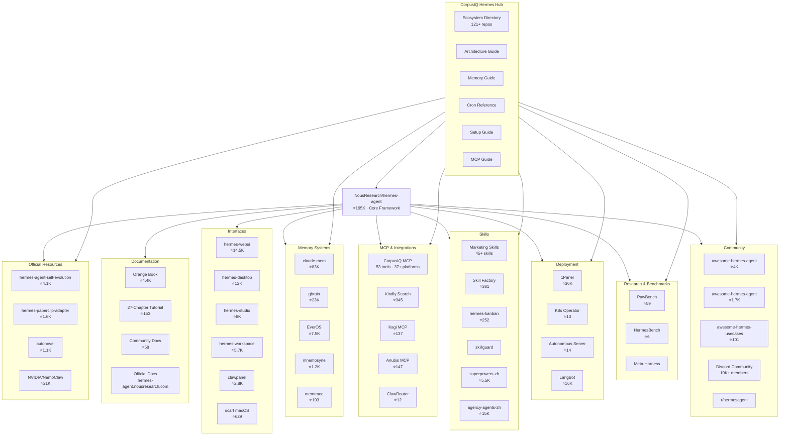
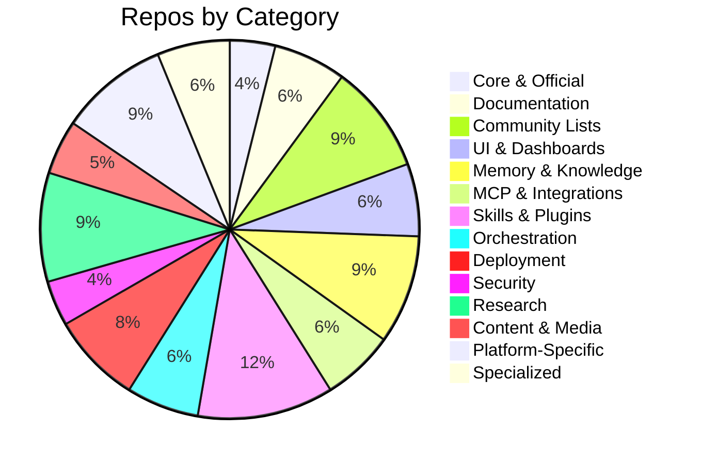
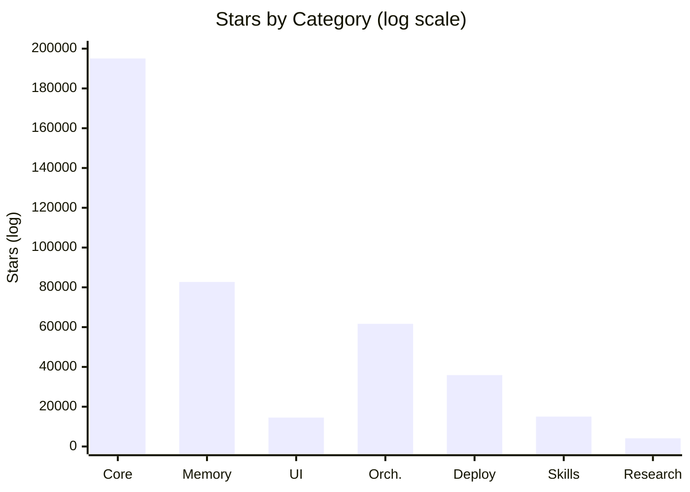
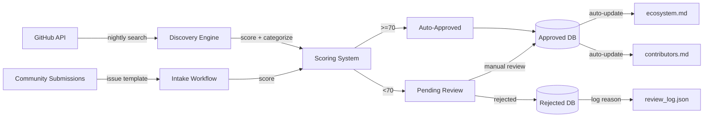

# Hermes Ecosystem Map

Visual map of the entire Hermes Agent ecosystem  --  every repository, category, and relationship.

## System Architecture

## Category Distribution

## Star Distribution

## Master Index

| # | Repository | Stars | Category |
|---|-----------|-------|----------|
| 1 | [NousResearch/hermes-agent](https://github.com/NousResearch/hermes-agent) | 195,064 | Core |
| 2 | [farion1231/cc-switch](https://github.com/farion1231/cc-switch) | 102,447 | Orchestration |
| 3 | [thedotmack/claude-mem](https://github.com/thedotmack/claude-mem) | 82,700 | Memory |
| 4 | [nexu-io/open-design](https://github.com/nexu-io/open-design) | 65,835 | UI |
| 5 | [Mintplex-Labs/anything-llm](https://github.com/Mintplex-Labs/anything-llm) | 61,663 | Orchestration |
| 6 | [colbymchenry/codegraph](https://github.com/colbymchenry/codegraph) | 50,162 | Specialized |
| 7 | [CherryHQ/cherry-studio](https://github.com/CherryHQ/cherry-studio) | 47,420 | Orchestration |
| 8 | [1Panel-dev/1Panel](https://github.com/1Panel-dev/1Panel) | 35,898 | Deployment |
| 9 | [iOfficeAI/AionUi](https://github.com/iOfficeAI/AionUi) | 28,359 | Orchestration |
| 10 | [garrytan/gbrain](https://github.com/garrytan/gbrain) | 22,991 | Memory |

[Full 121+ repo directory →](/hermes/ecosystem.md)

## Data Flow

## How It Works

1. **Nightly Discovery (10 PM - 2 AM AZ):** The discovery engine searches GitHub across 20 query categories for new Hermes-related repos.

2. **Automated Scoring:** Each repo is scored 0-100 on: relevance, quality, activity level, documentation, adoption, and uniqueness.

3. **Auto-Approval:** Repos scoring 70+ are automatically added to the ecosystem.

4. **Manual Review:** Repos scoring 50-69 are prioritized for review. Repos scoring 30-49 enter the review queue.

5. **Community Submissions:** Anyone can submit a repo via the [GitHub issue template](https://github.com/CorpusIQ/corpusiq-docs/issues/new?template=submit-repo.yml). Submissions are scored and processed within 48 hours.

6. **Database Sync:** All additions update the ecosystem.md directory, contributors page, and master index automatically.
---

*

---

*This Hermes repo is one of the largest structured collections of public AI, automation, business, and technology documentation. Content remains attributed to original authors and repositories. Indexed and organized by [www.CorpusIQ.io](https://www.corpusiq.io).*
